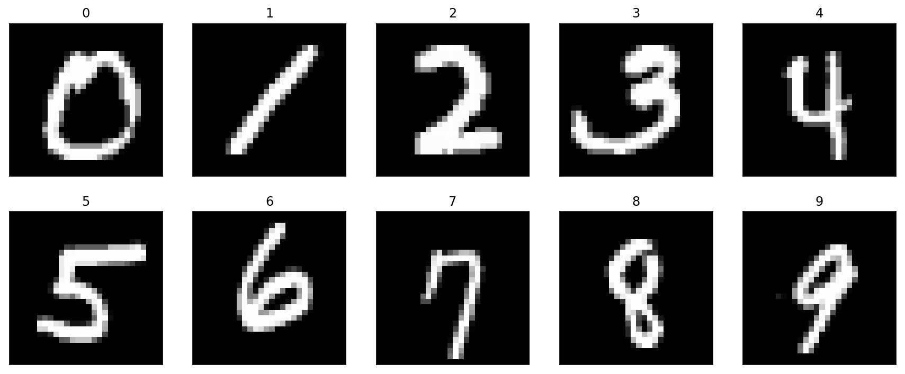
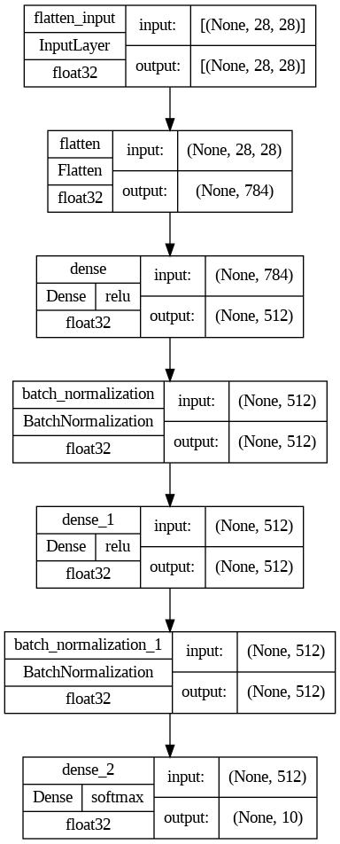
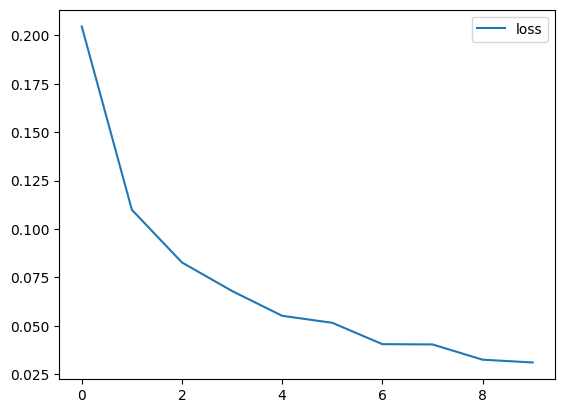
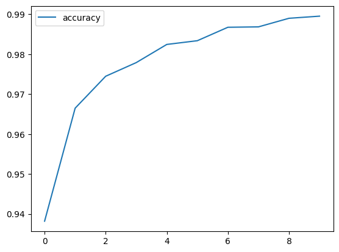
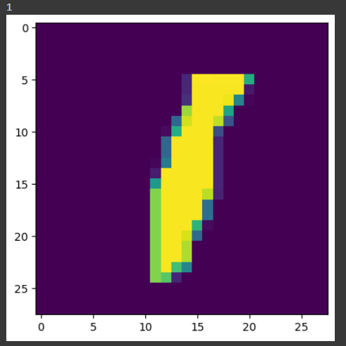
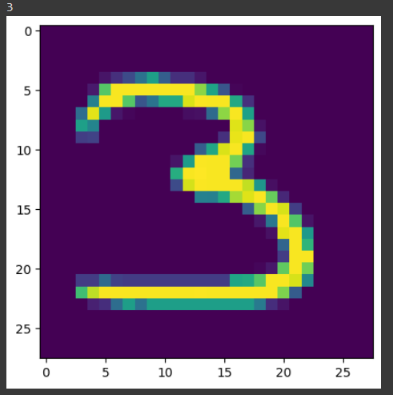

# Кошки и Собаки Распознавание

Этот репозиторий содержит обученную модель нейронной сети для распознавания рукописных цифр из набора данных MNIST. Модель построена с использованием библиотеки Keras и представляет собой сверточную нейронную сеть с архитектурой, включающей плоский слой для выравнивания данных, два полносвязных слоя с 512 нейронами и функцией активации ReLU, два слоя нормализации данных и выходной слой с десятью нейронами и функцией активации softmax.

## Обзор архитектуры модели

Архитектура модели выглядит следующим образом:

1. Плоский слой для выравнивания данных
2. Полносвязный слой (512 нейронов) с функцией активации ReLU
3. Слой нормализации данных
4. Полносвязный слой (512 нейронов) с функцией активации ReLU
3. Слой нормализации данных
5. Выходной слой с десятью нейронами и функцией активации softmax

## Обучение и Результаты

Модель обучалась на наборе данных MNIST в течение 10 эпох. На 10-й эпохе достигнуты следующие показатели:

- Потери (loss): 0.0295
- Точность (accuracy) на тренировочных данных: 0.8697

## Тестирование

Проверка работы модели на тестовых данных:

